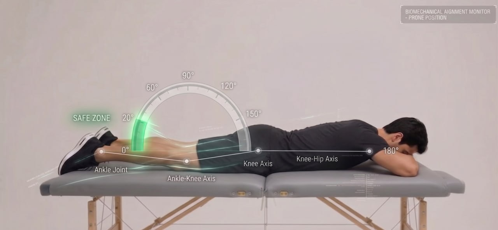
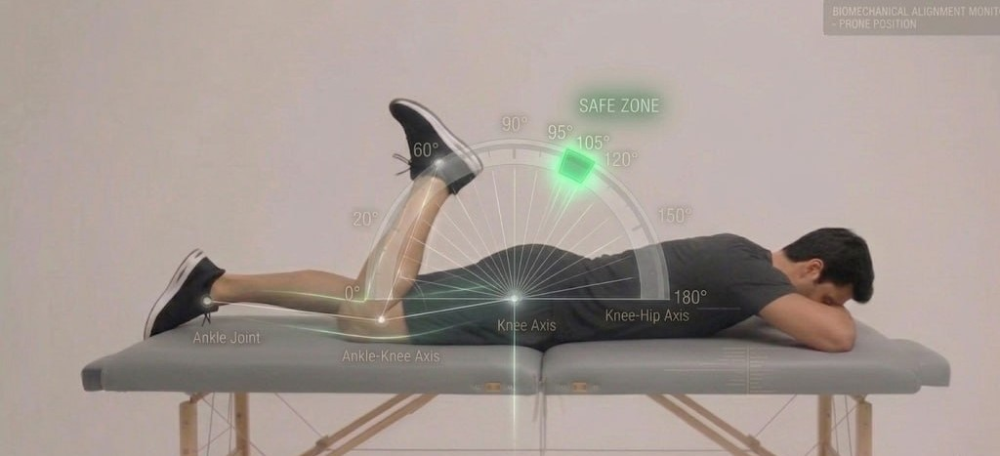

# Exercise Output Documentation & Definitions

## 🎥 Demonstration

<div align="center">

https://github.com/user-attachments/assets/6cde6456-6c7c-49bf-a7a2-8c6f91a38499

  <p><i>Real-time exercise detection and joint angle tracking.</i></p>
</div>

---

## 🏃 Pose Definitions & Ranges

To ensure accuracy, the engine validates movements based on specific target poses. Below are the visual definitions for each pose and their acceptable joint angle ranges.

### Pose 1: Starting Position
<div align="center">
  
  <p><b>Acceptable Range:</b> Joint angles must be within the highlighted zones to trigger the "In Pose" state. This represents the starting position of the movement.</p>
</div>

### Pose 2: Target Position
<div align="center">
  
  <p><b>Acceptable Range:</b> This pose represents the peak of the movement. Full range of motion is required to validate the repetition. Joint angles must reach the designated threshold.</p>
</div>

---

## Overview
This output provides a structured JSON object containing data related to **Body Pose** detection, joint angles, and their corresponding timing. The system monitors the user's physical orientation and movements to categorize them into cycles and continuous timelines.

### Key Concepts
* **Body Pose**: The specific orientation or position of the user's body limbs and torso at a given moment, recognized by the detection engine.

---

## Root Object
The root response consists of two main arrays:

| Field Name | Data Type | Description |
| :--- | :--- | :--- |
| `cycles` | Array of Objects | A list of movement cycles. Each cycle includes start/end times and a collection of specific poses. |
| `timelines` | Array of Objects | A continuous temporal stream of events, including recognized poses and "gap" periods. |

---

## 1. Cycles Object
Each item in the `cycles` array represents a general time frame containing recognized physical movements.

* **Cycle**: A complete set of movements or a single repetition of an exercise, beginning from the first recognized pose and ending at the conclusion of the last pose in that sequence.

| Field Name | Data Type | Description |
| :--- | :--- | :--- |
| `from` | Number (Timestamp) | The start time of the cycle in Unix Timestamp format (milliseconds). |
| `to` | Number (Timestamp) | The end time of the cycle in Unix Timestamp format (milliseconds). |
| `poses` | Array of Objects | An array of specific recognized positions performed during this cycle. |

### Poses Sub-Object (Within Cycles)
* **Poses**: These are discrete, predefined target positions that a user must reach to complete parts of a cycle (e.g., the "up" or "down" position of a squat).

| Field Name | Data Type | Description |
| :--- | :--- | :--- |
| `id` | String (UUID) | Unique identifier for this specific pose occurrence. |
| `from` / `to` | Number | Precise start and end timestamps for this pose. |
| `poseId` | String (UUID) | Reference ID for the type of pose. |
| `poseName` | String | The human-readable name of the pose (e.g., "pose 1"). |
| `angles` | Object | Numerical values representing the joint angles measured during this pose. |
| `conditionPoses` | Array | Array of values representing The distance conditions or custom conditions that have been set in the Exercise Engine. |

---

## 2. Timelines Object
The `timelines` section represents a continuous sequence of time segments. This section also indicates how quickly or slowly the exercise was completed.

### Pose vs. Gap
In the timeline, every segment is classified into one of two states:
* **In Pose**: The user is currently maintaining a recognized target position.
* **In Gap**: The transition period between two poses. A "Gap" represents the movement or "travel time" where the user has left one pose but has not yet reached the next recognized one.

| Field Name | Data Type | Status | Description |
| :--- | :--- | :--- | :--- |
| `id` | String (UUID) | Required | Unique identifier for this timeline segment. |
| `from` / `to` | Number | Required | Start and end timestamps for the segment. |
| `poseId` / `poseName` | String | Optional | Populated if the segment is a **Pose**. Null/Empty if the segment is a **Gap**. |
| `angles` | Object | Required | Continuous recording of angles, providing data during both poses and gaps. |

---

## Joint Angles Object (angles)
* **Joint Angles**: The relative angle (measured in degrees) between two connected body segments (e.g., the angle at the elbow or shoulder), used to verify the correctness of a pose.

| Field Name (Example) | Data Type | Description |
| :--- | :--- | :--- |
| `Left Shoulder` | Number | Measured angle of the left shoulder joint. |
| `Left Elbow` | Number | Measured angle of the left elbow joint. |

---

## Payload Example

```json
{
  "error": false,
  "message": "",
  "mode": "execute",
  "data": {
    "cycles": [
      {
        "from": 1779194438336,
        "poses": [
          {
            "id": "d7122aa1-1689-4de3-964b-d37473488da7",
            "from": 1779194438336,
            "to": 1779194441778,
            "poseId": "dbfc81f0-1ed6-49ac-ae45-3713071effd3",
            "poseName": "Pose 1",
            "angels": {},
            "conditionPoses": [
              {
                "label": "neck",
                "result": true,
                "data": {
                  "angle": 6,
                  "percent": 92,
                  "direction": "right"
                }
              }
            ]
          },
          {
            "id": "598d5a3b-91cf-4121-bb94-ca762e74d034",
            "from": 1779194441836,
            "to": 1779194444514,
            "poseId": "e8722f23-b987-457f-b453-cd418f8227fe",
            "poseName": "Pose 2",
            "angels": {},
            "conditionPoses": [
              {
                "label": "neck",
                "result": true,
                "data": {
                  "angle": 33,
                  "percent": 56,
                  "direction": "right"
                }
              }
            ]
          }
        ],
        "to": 1779194444579
      },
      {
        "from": 1779194444579,
        "poses": [
          {
            "id": "51846f6f-894a-472a-8761-0c3435c45868",
            "from": 1779194444579,
            "to": 1779194447115,
            "poseId": "dbfc81f0-1ed6-49ac-ae45-3713071effd3",
            "poseName": "Pose 1",
            "angels": {},
            "conditionPoses": [
              {
                "label": "neck",
                "result": true,
                "data": {
                  "angle": 25,
                  "percent": 67,
                  "direction": "right"
                }
              }
            ]
          },
          {
            "id": "d6141372-5095-44df-9c97-1448385db0df",
            "from": 1779194447181,
            "to": 1779194449943,
            "poseId": "e8722f23-b987-457f-b453-cd418f8227fe",
            "poseName": "Pose 2",
            "angels": {},
            "conditionPoses": [
              {
                "label": "neck",
                "result": true,
                "data": {
                  "angle": 32,
                  "percent": 57,
                  "direction": "left"
                }
              }
            ]
          }
        ],
        "to": 1779194449943
      }],
    "timelines": [
      {
        "id": "d7122aa1-1689-4de3-964b-d37473488da7",
        "from": 1779194438336,
        "to": 1779194441778,
        "poseId": "dbfc81f0-1ed6-49ac-ae45-3713071effd3",
        "poseName": "Pose 1",
        "angels": {},
        "conditionPoses": [
          {
            "label": "neck",
            "result": true,
            "data": {
              "angle": 6,
              "percent": 92,
              "direction": "right"
            }
          }
        ]
      },
      {
        "id": "647119ed-9f52-4a95-ba2f-0cb660cfaf15",
        "from": 1779194441778,
        "to": 1779194441836,
        "angels": {}
      },
      {
        "id": "598d5a3b-91cf-4121-bb94-ca762e74d034",
        "from": 1779194441836,
        "to": 1779194444514,
        "poseId": "e8722f23-b987-457f-b453-cd418f8227fe",
        "poseName": "Pose 2",
        "angels": {},
        "conditionPoses": [
          {
            "label": "neck",
            "result": true,
            "data": {
              "angle": 33,
              "percent": 56,
              "direction": "right"
            }
          }
        ]
      },
      {
        "id": "2ce2d87a-5e19-4d2c-8c34-10d154885d10",
        "from": 1779194444514,
        "to": 1779194444579,
        "angels": {}
      },
      {
        "id": "51846f6f-894a-472a-8761-0c3435c45868",
        "from": 1779194444579,
        "to": 1779194447115,
        "poseId": "dbfc81f0-1ed6-49ac-ae45-3713071effd3",
        "poseName": "Pose 1",
        "angels": {},
        "conditionPoses": [
          {
            "label": "neck",
            "result": true,
            "data": {
              "angle": 25,
              "percent": 67,
              "direction": "right"
            }
          }
        ]
      },
      {
        "id": "eb85dce2-c2cd-4dc7-853b-6f9ec44992a5",
        "from": 1779194447115,
        "to": 1779194447181,
        "angels": {}
      },
      {
        "id": "d6141372-5095-44df-9c97-1448385db0df",
        "from": 1779194447181,
        "to": 1779194449943,
        "poseId": "e8722f23-b987-457f-b453-cd418f8227fe",
        "poseName": "Pose 2",
        "angels": {},
        "conditionPoses": [
          {
            "label": "neck",
            "result": true,
            "data": {
              "angle": 32,
              "percent": 57,
              "direction": "left"
            }
          }
        ]
      },
      {
        "id": "525ba19b-0b61-4af2-89e9-5eb64fca2758",
        "from": 1779194449943,
        "to": 1779194452250,
        "poseId": "dbfc81f0-1ed6-49ac-ae45-3713071effd3",
        "poseName": "Pose 1",
        "angels": {},
        "conditionPoses": [
          {
            "label": "neck",
            "result": true,
            "data": {
              "angle": 28,
              "percent": 63,
              "direction": "left"
            }
          }
        ]
      },
      {
        "id": "8e0e3e4e-c9c0-423e-9d9f-7e19084f4306",
        "from": 1779194452250,
        "to": 1779194452325,
        "angels": {}
      },
      {
        "id": "cad45716-87d2-4d4f-9951-17209fd1b8ec",
        "from": 1779194452325,
        "to": 1779194455154,
        "poseId": "e8722f23-b987-457f-b453-cd418f8227fe",
        "poseName": "Pose 2",
        "angels": {},
        "conditionPoses": [
          {
            "label": "neck",
            "result": true,
            "data": {
              "angle": 33,
              "percent": 56,
              "direction": "right"
            }
          }
        ]
      },
      {
        "id": "6d59e0e9-80bd-4bc9-9e98-bc9343c96f94",
        "from": 1779194455154,
        "to": 1779194457041,
        "poseId": "dbfc81f0-1ed6-49ac-ae45-3713071effd3",
        "poseName": "Pose 1",
        "angels": {},
        "conditionPoses": [
          {
            "label": "neck",
            "result": true,
            "data": {
              "angle": 27,
              "percent": 64,
              "direction": "right"
            }
          }
        ]
      },
      {
        "id": "ae0b968e-61a0-446c-a27c-8dfa2033da59",
        "from": 1779194457041,
        "to": 1779194457113,
        "angels": {}
      } 
    ]
  },
  "exerciseKey": "3dcd3b82-9102-44fa-ac33-ae450c09598b",
  "metadata": "sampleUserDataForModify"
}
