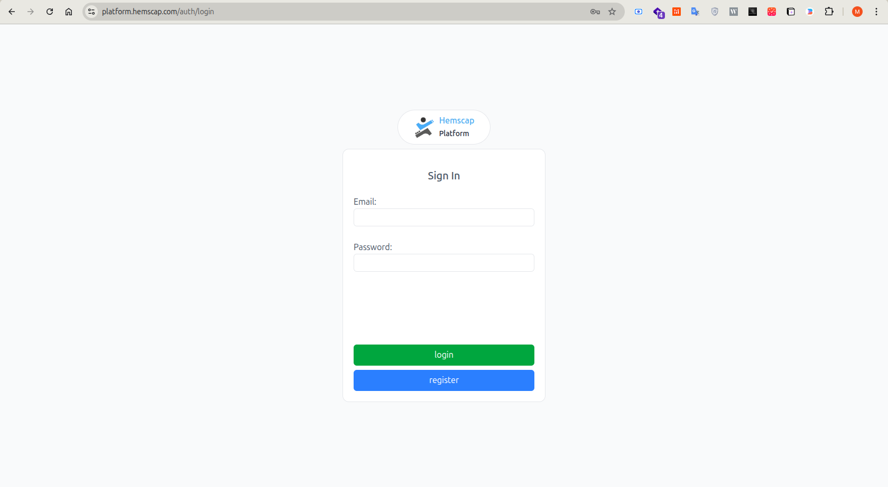
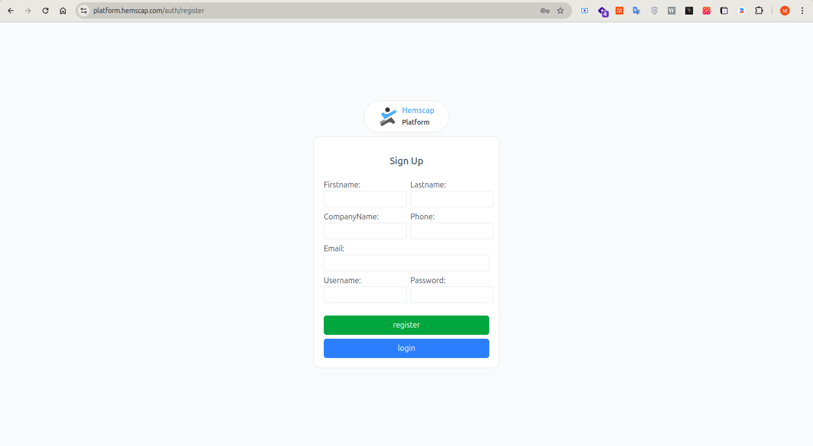
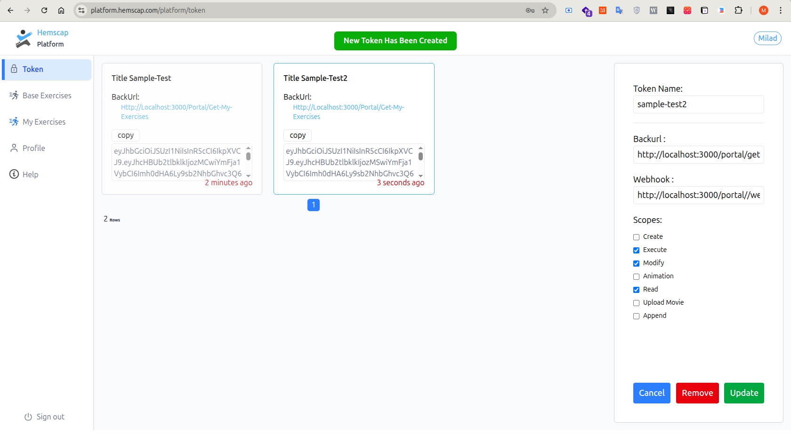

# Sample Exercise Engine Usage

A Bun.js sample portal for the Exercise-Engine platform. This repository demonstrates how to:

- Authenticate users with email/password and JWT cookies
- Render a portal UI with exercise cards
- Proxy exercise requests to an external Exercise-Engine API
- Redirect users to create, execute, and modify exercise flows
- Fetch exercise images through a backend proxy

> This project is a sample integration layer / frontend portal for the Exercise-Engine platform and is designed to be easy to run locally.

## 🛠️ Before Running the Project

1. Log in to the platform.
   - Use the platform URL provided by our team.
   - Sign In page: https://platform.hemscap.com/auth/login
     

2. If you do not have an account, go to the Register page.
   - Fill in your registration details.
   - Submit the registration form.
   - Contact the project team to activate your account.
   - Register page: https://platform.hemscap.com/auth/register
     

3. After logging in, open the token management page.
   - Create one or more tokens based on the project needs.
   - Each token can have different permissions, Backurl, and Webhook settings.
   - Use the token settings that match your integration requirements.
   - Create multiple tokens:
     

4. Copy the generated token and paste it into the `.env` file as `ACCESS_TOKEN`.

## 📌 Prerequisites

Before you run the project, make sure you have Bun installed.

- Bun is a modern JavaScript runtime and package manager optimized for performance.
- If you do not have Bun installed, follow the official install guide:
  ```bash
  curl -fsSL https://bun.sh/install | bash
  ```
- After installation, verify with:
  ```bash
  bun --version
  ```
  ```bash
  source ./bashrc
  ```

## 🚀 Quick Start

1. Clone the Git repository:
   ```bash
   git clone https://github.com/git-bakhshabadi/sample-worker-fit.git
   ```
2. Go to the project folder:
   ```bash
   cd sample-worker-fit
   ```
3. Install Bun dependencies:
   ```bash
   bun install
   ```
4. Create a `.env` file from `.env.example`:
   ```bash
   cp .env.example .env
   ```
5. Update `.env` with your actual token and API endpoints.
6. Run the app:
   ```bash
   bun run src/main.ts
   ```
7. Open the portal in your browser:
   ```
   http://localhost:3000
   ```

## 📁 Project Structure

- `src/main.ts` — application entry point, template setup, route registration
- `src/routes/auth.route.ts` — register, login, logout routes
- `src/routes/portal.route.ts` — portal API proxy and redirect routes
- `src/middlewares/auth.middleware.ts` — JWT cookie authentication guard
- `src/utils/db.helper.ts` — Bun SQLite database initialization
- `src/views/` — EJS templates for login, register, and home portal
- `database/` — local SQLite database storage
- `portal-document.pdf` — attached platform documentation for API gateway integration

## 🧩 What This App Does

### Authentication

- `GET /auth/login` — login page
- `POST /auth/login` — verify user credentials
- `GET /auth/register` — registration page
- `POST /auth/register` — create a new local user in SQLite
- `GET /auth/logout` — clear session cookie and redirect to login

### Portal Actions

- `GET /` — home page or login page
- `GET /portal/get-my-exercises` — loads exercise list from the external API and renders the dashboard
- `POST /portal/get-my-exercises` — returns the raw JSON exercise list
- `GET /portal/execute/:key` — redirects to external exercise execution URL
- `GET /portal/create/:metadata` — redirects to external exercise creation URL
- `GET /portal/modify/:exerciseKey/:metadata` — redirects to external exercise modification URL
- `GET /portal/exercise-image/:key` — proxies exercise image requests from the remote API
- `POST /portal/webhook/:key` — webhook placeholder for exercise execution events

## ⚙️ Environment Variables

Create a `.env` file and set the following values:

```env
PORT=3000
SESSION_SECRET=your-session-secret
JWT_SECRET=your-jwt-secret
DEFAULT_USER=demo@example.com
DEFAULT_PASS=demo-password
ACCESS_TOKEN=YOUR_PLATFORM_ACCESS_TOKEN
API_GET_MY_EXERCISES=https://api.platform.hooshtavan.com/v1/api/platform/portal/info-swagger/exercise/me
API_REDIRECT_EXECUTE_EXERCISE=https://api.platform.hooshtavan.com/v1/api/platform/portal/info-swagger/exercise/execute/{exerciseKey}
API_REDIRECT_CREATE_EXERCISE=https://api.platform.hooshtavan.com/v1/api/platform/portal/info-swagger/exercise-redirect/create
API_REDIRECT_MODIFY_EXERCISE=https://api.platform.hooshtavan.com/v1/api/platform/portal/info-swagger/exercise-redirect/{exerciseKey}/modify
API_GET_EXERCISE_IMAGE=https://api.platform.hooshtavan.com/v1/api/platform/portal/info-swagger/exercise/image/{exerciseKey}/{poseId}
DB_PATH=database/database.db
```

> Note: `SESSION_SECRET` is used by express-session, and `JWT_SECRET` is used for cookie authentication.

## 🎯 How to Use

1. Open `http://localhost:3000`.
2. Register a new account or use default credentials if provided.
3. After login, the portal fetches your exercises from the external Exercise-Engine API.
4. Click `Start` to redirect to exercise execution.
5. Use `Edit` to redirect to the exercise modification flow.

## 🧪 Integration Details

This app does not implement the full Exercise-Engine platform itself. Instead, it acts as a portal integration layer:

- It uses `ACCESS_TOKEN` in requests to the external API.
- It renders exercise cards from API data.
- It redirects to exercise creation and execution URLs with the required token.
- It proxies exercise images from the external image endpoint.

### Current webhook behavior

The current `POST /portal/webhook/:key` route only logs incoming payloads. If you want production-ready webhook handling, add a response such as `res.sendStatus(200)` and process `req.body`.

## 📌 Notes

- The app is designed for Bun.js. Use Bun to run and build.
- The local database file is created under `database/database.db` by default.
- The portal UI is rendered with EJS templates and Tailwind CSS.
- If you want to use another database location, set `DB_PATH` in `.env`.

## 📘 Platform Documentation

- The repository includes `portal-document.pdf` with platform integration details.
- For full API reference, use the external platform docs if available.

## ✅ Recommended Commands

```bash
bun install
bun run src/main.ts
bun build ./src/main.ts --outdir ./dist
bun run dist/src/main.js
```

## 🛠️ Troubleshooting

- If the dashboard does not load, verify `ACCESS_TOKEN` and the external API URLs.
- If login fails, check `JWT_SECRET` and registered email/password values.
- If the app cannot open the database, validate `DB_PATH` and permissions.

## 📄 Portal Documentation

The complete portal documentation is available in [portal-document.md](./portal-document.md).

## 📊 Exercise Page Output
To view the detailed structure of the motion detection engine results (including cycles, timelines, and joint angles), please refer to the following documentation:

👉 [View Exercise Output Documentation](EXERCISE_OUTPUT.md)
