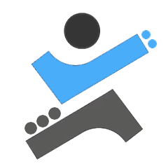

<div align="center">

# 🏋️‍♂️ **Exercise Engine** -



**Intelligent Platform for Creating, Executing & Evaluating Sports Exercises**

**Real-time AI Feedback • Multi-Camera Analysis • Fully Customizable**

</div>

---

## ✨ About Exercise Engine

**Exercise-Engine** is a comprehensive and innovative fitness platform that combines **Artificial Intelligence, Motion Analysis, and Visual Simulation** to deliver a scientific and interactive workout experience.

It empowers **regular users, fitness enthusiasts, physiotherapists, and professional trainers** to design custom exercises, execute them with precision, and receive instant, accurate feedback on movement quality.

---

## 🎯 Key Objectives

- **Custom Exercise Creation** with real-time movement evaluation
- **Support for Multiple Exercise Types**:
  - Angular (Range-of-Motion) Exercises
  - Distance-Based Exercises
  - Facial Exercises
- **Multi-Camera Support** for maximum accuracy
- **Unlimited Multi-Stage Exercise Definition**
- **Comprehensive Performance Analytics**

---

## 🚀 Highlights & Features

| Feature                       | Description                             | Status |
| ----------------------------- | --------------------------------------- | ------ |
| **Real-time Motion Tracking** | Precise joint angle & distance analysis | ✅     |
| **Multi-Camera System**       | Simultaneous front, left, right views   | ✅     |
| **Multi-Stage Workouts**      | Unlimited phases per exercise           | ✅     |
| **Timeline Analysis**         | Detailed movement breakdown over time   | ✅     |
| **Smart Pose Generation**     | Automatically generate correct poses    | ✅     |
| **3D Visual Feedback**        | Interactive animated models             | ✅     |
| **User-Friendly Interface**   | Intuitive for all skill levels          | ✅     |
| **Powerful API & Webhooks**   | Seamless integration with your platform | ✅     |

---

## 🛠️ How to Use

You can integrate **Exercise Engine** in two ways:

### 1. **Gateway / Redirect Integration** (Recommended)

Easiest and fastest way to embed the platform into your existing website or app.

### 2. **Custom Application Development**

For fully branded, standalone solutions.

---

## 📡 Related Systems

| System               | URL                                                   | Purpose                    |
| -------------------- | ----------------------------------------------------- | -------------------------- |
| **Main Portal**      | [portal.hemscap.com](https://portal.hemscap.com/)     | End-user interface         |
| **Platform Manager** | [platform.hemscap.com](https://platform.hemscap.com/) | API Key & Token Management |
| **API Base**         | `https://api.platform.hemscap.com`                    | All programmatic requests  |
| **Swagger Docs**     | [/info](https://api.platform.hemscap.com/info)        | Full API documentation     |

---

## 🚀 Quick Start

1. Register at [platform.hemscap.com](https://platform.hemscap.com/auth/register)
2. Create an **Access Token** with required scopes (`read`, `create`, `modify`, `execute`)
3. Configure your **Webhook URL** (for execution results)
4. Start testing with **Postman** or **Swagger UI**

---

## 📋 Main API Operations

### Exercise Management

```http
GET    /exercise/search                    # Search available exercises
POST   /exercise/append-exercise/{key}     # Add predefined exercise
GET    /exercise/me                        # Get my exercises
```
